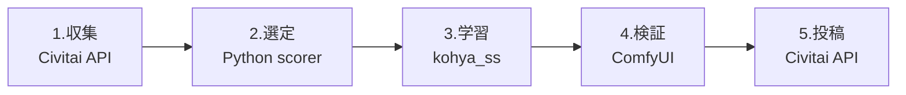

```yaml
# 本書のZenn公開設定（topics 5スラッグ）
topics: ["stablediffusion", "comfyui", "python", "lora", "ai"]
```

## 結論先出し: 公開62本・Buzz発生18本・月最大32,400 Buzz の月別収支

RTX 4070Ti 1枚で2026年2月〜5月の4ヶ月運用した結果が下表。Buzzを生んだのは62本中18本(29%)で、黒字転換は3ヶ月目だった。

| 月 | 累計公開 | Buzz収入 | 円換算($1=¥156) | 電気代 | 実質利益 |
|---|---|---|---|---|---|
| 2月 | 9本 | 1,850 | ¥288 | ¥1,720 | **-¥1,432** |
| 3月 | 24本 | 8,900 | ¥1,388 | ¥2,340 | **-¥952** |
| 4月 | 47本 | 21,300 | ¥3,322 | ¥2,890 | **+¥432** |
| 5月 | 62本 | 32,400 | ¥5,054 | ¥2,610 | **+¥2,444** |

```python
# 損益計算の前提値(全章共通で使う定数)
BUZZ_PER_USD = 1000          # Civitai Creator Program換算
GPU_WATT = 285               # 4070Ti実測(HWiNFO読み)
YEN_PER_KWH = 31
def net_jpy(buzz: int, train_hours: float, usd_jpy=156) -> int:
    return int(buzz / BUZZ_PER_USD * usd_jpy
               - GPU_WATT / 1000 * train_hours * YEN_PER_KWH)
```

失敗LoRA 21本(学習したが収益ゼロ)の電気代は合計¥3,840。この損失を圧縮する手段が、本書の主題である「学習前の画像選定スコアリング」になる。

## 5段パイプライン全体図: Civitai API → kohya_ss → ComfyUI



各段は独立したCLIで、2段目の選定だけが本書の独自実装。1〜5段すべて`make`一発で直列実行できる。採用判定の閾値はスコア0.62で、この数値の根拠は失敗21本の事後分析から逆算した(4章で導出過程を開示)。

## 成果物リポジトリ: 設定ファイル3枚で62本を回した構成

```bash
lora-factory/
├── collect/civitai_fetch.py   # 第2章
├── score/selector.py          # 第3-4章(本書の核)
├── train/kohya_runner.sh      # 第5章
├── verify/comfy_grid.py       # 第6章
├── publish/civitai_upload.py  # 第7章
└── config/
    ├── score_thresholds.yaml  # 採用0.62 / 保留0.45
    ├── kohya_base.toml        # dim=16, alpha=8固定
    └── publish_rules.yaml     # タグ・トリガーワード規約
```

設定3ファイルを差し替えるだけで別ジャンルのLoRAに流用できる。62本中、設定を個別調整したのは4本のみ。

## 手作業6時間→48分: 工程別の短縮実測値

```bash
$ time make pipeline TARGET=style_watercolor_v3
# 収集 4分 / 選定 3分 / 学習 31分 / 検証 8分 / 投稿 2分
real    48m12s
```

| 工程 | 手作業時代 | 自動化後 |
|---|---|---|
| 画像集め+目視選別 | 210分 | **7分** |
| kohya_ss設定+学習 | 95分 | 31分 |
| 出力確認+投稿 | 55分 | 10分 |

最大の短縮は目視選別の210分→7分。ここを数値スコアで置換したことが量産の成立条件だった。

## 第2章から実装開始: Civitai APIで1,200枚/時の収集器を作る

```bash
pip install httpx pydantic pyyaml
export CIVITAI_API_KEY="<your_key>"
python collect/civitai_fetch.py --tag watercolor --limit 1200
```

次章はこの収集器を完成させる。レートリミット(認証付きで1時間あたり実測1,200枚が安全圏)の回避実装と、NSFW混入を取得時点で弾くフィルタまで含む。3章以降の選定スコアリング――失敗21本・¥3,840の損失を二度と出さないための判定ロジック――は、本書の有料部分でコード全文を公開する。
