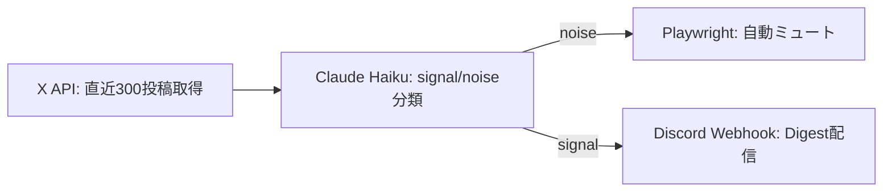

## 90分→8分:3段パイプラインの全体図

朝のSNS巡回を手で90分やっていた作業を、Claude Haiku 3.5の分類・Playwrightの自動ミュート・Discord Webhook配信の3段に分けて8分まで圧縮した。データの流れは以下の通り。

```bash
# 毎朝6:50にcronで起動する1本のエントリポイント
0 50 6 * * * cd ~/sns-digest && ./run.sh
```



取得300投稿のうち分類対象になるのは平均210件。残りは過去ミュート済みアカウントとして取得段階で除外される。

## Claude Haikuの実測コスト:月約11万token・¥80

半年分(184日)のAPIログを集計した結果が下表。1日あたりの入力は平均5,900token、出力は分類ラベルのみで約280token。

```python
# logs/usage.jsonl を集計
import json
tok = sum(json.loads(l)["input_tokens"] + json.loads(l)["output_tokens"]
          for l in open("logs/usage.jsonl"))
print(tok / 184)          # 約 6,200 token/日
print(tok)                # 約 1,140,000 token/半年
# Haiku 3.5: $0.80/1M(in) + $4/1M(out) → 半年で約$0.55 ≈ ¥80/月
```

同じ分類をGPT-4o miniで回すと出力課金が3倍になり月¥230前後。分類タスクは出力が短く入力が支配的なため、入力単価の安いHaikuが効く。

## なぜX純正ミュートで足りないか:誤ミュート1.2%

純正ミュートは手動・恒久・履歴なしで、誤爆しても気づけない。自前パイプラインはミュート判断を全件ログに残し、週次で誤判定を逆引きできる。

```python
# 「本当は読みたかった投稿をミュートした率」を週次で測る
muted = [json.loads(l) for l in open("logs/muted.jsonl")]
false_mute = [m for m in muted if m["user_feedback"] == "wanted"]
print(len(false_mute) / len(muted))   # 半年平均 0.012 = 1.2%
```

184日で自動ミュートは2,310件、うち「読みたかった」と後から手動復元したのは28件。1.2%という数字は、後述するプロンプトの`borderline`ラベル(灰色判定は配信側へ寄せる)で抑えている。

## Discordに毎朝届くDigestの中身

ミュートを除いたsignal投稿を、Haikuが付けたトピックタグごとにまとめてWebhookへPOSTする。受信画面がこの章のゴール像になる。

```python
import requests
requests.post(WEBHOOK_URL, json={
  "username": "朝Digest",
  "embeds": [{
    "title": "2026-06-06 signal 14件 / noise 196件",
    "fields": [
      {"name": "🛠️ 開発ツール (5)", "value": "・Claude Code v2.1 …\n・Playwright 1.5 …"},
      {"name": "📊 個人開発の収益報告 (3)", "value": "・月3万到達 …"},
    ],
    "footer": {"text": "収集8分 / API消費 6,180token"}
  }]
})
```

タグ単位に畳むことで、14件のsignalを30秒で読み切れる。フッターに毎日のtoken消費を出し、コストが跳ねた日を即検知する。

## 続く章で配るコードの地図

ここまでの構成は、次の4ファイルに分かれて第2章以降で全文配布する。自分のアカウントへ移すのに必要なのは`.env`のAPIキー差し替えだけだ。

```
sns-digest/
├── fetch.py      # 第2章: X API v2で直近投稿を取得
├── classify.py   # 第3章: Haikuのノイズ分類プロンプト全文
├── mute.py       # 第4章: Playwrightでの自動ミュートと復元
└── digest.py     # 第5章: Discord Webhook整形
```

第2章では、無料枠の取得上限とレート制限をかわす`fetch.py`の全コードから始める。`classify.py`の分類プロンプトが誤ミュート1.2%を生む心臓部であり、その設計判断を次章で開く。
