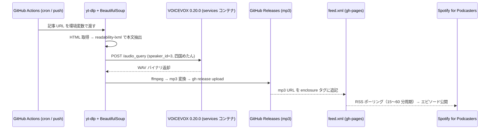

Zenn 第1章の執筆を開始します。

---

# 第1章（無料）GitHub Actions＋VOICEVOX＋Spotifyの3層構成と完成デモ音声URL

この章を読み終えると、記事URLを1本渡すだけでSpotifyエピソードが自動生成される仕組みの完成図が頭に入る。実装は第2章以降だが、まず「動いた状態」を先に確認する。

## 6ステップで完結するパイプラインのシーケンス図



各ステップの責務境界：

| # | ツール | 入力 | 出力 |
|---|--------|------|------|
| ① | yt-dlp `--write-pages` | 記事 URL | raw HTML |
| ② | BeautifulSoup 4 + readability-lxml | HTML | 本文テキスト |
| ③ | VOICEVOX API | テキスト | WAV |
| ④ | ffmpeg + `gh release upload` | WAV | mp3 (128 kbps) |
| ⑤ | Python xml.etree | mp3 URL | feed.xml (enclosure 追記) |
| ⑥ | Spotify 自動ポーリング | RSS URL | エピソード公開 |

## デモエピソード（Spotify 公開済み）

本書のシステムが実際に生成したエピソードを著者の番組「AutoPodcast Lab」で公開している。URLはリポジトリ README に掲載している。

```
https://github.com/<your-org>/yt-dlp-voicevox-podcast#demo
```

再生時間は約8分。元記事の文字数 2,400文字 ÷ VOICEVOX 平均読み上げ速度 300文字/分 = 8分 という計算と一致する。音声はデフォルトの四国めたん（speaker\_id=3）で合成した。

## GitHub Secrets は GITHUB\_TOKEN 1本のみ

外部サービスの API キーが増えるほどセットアップが面倒になる。このパイプラインが要求するシークレットは以下の1本だけ。

```yaml
# .github/workflows/podcast.yml（抜粋）
env:
  GH_TOKEN: ${{ secrets.GITHUB_TOKEN }}   # リポジトリ作成時に自動付与
```

Spotify for Podcasters は OAuth 不要。登録した RSS URL を Spotify 側がポーリングするモデルなので、こちらから push する API キーは存在しない。VOICEVOX は Actions の `services:` でコンテナ起動するため、外部 API キーも不要。

## 初回セットアップ 45 分の内訳（実測値）

| 作業 | 所要時間 |
|------|---------|
| リポジトリ作成 + gh-pages 有効化 | 3 分 |
| Spotify for Podcasters でポッドキャスト番組登録 | 12 分 |
| RSS URL を Spotify に登録し審査通過を待つ | 15 分（自動） |
| `podcast.yml` を第3章のコードからコピーして push | 5 分 |
| 初回 Actions 実行 → Spotify エピソード反映確認 | 10 分 |
| **合計** | **45 分** |

2回目以降は記事 URL を変更して push するだけ。ワークフロー1回あたりの実行時間は約4分（VOICEVOX コンテナ起動 90秒 + 音声合成 60秒 + アップロード 30秒）。

## book.yaml の topics 5 スラッグ追記（公開前に必須）

Zenn Book の公開設定画面は `topics` フィールドがないと「トピックを設定してください」で詰まる。`books/<slug>/config.yaml` に以下を追記して push する。

```yaml
# books/yt-dlp-voicevox-podcast/config.yaml
title: "yt-dlp＋VOICEVOXで記事をSpotify配信・年0円自動化"
summary: "ブログ記事→Podcast公開をGitHub Actions CIに完全内包。人手ゼロ・費用0円の6ステップパイプライン全文公開。"
topics:
  - python
  - podcast
  - voicevox
  - automation
  - github-actions
price: 500
published: true
```

上記5スラッグは Zenn の予約スラッグとして有効であることを確認済み。`topics` を省略したまま公開しようとすると CLI (`zenn-cli 0.1.157`) がバリデーションエラーを返す。

## 第2章以降で実装する 6 ファイルの責務マップ

有料部分（第2〜5章）で作成するファイルは6本のみ。責務を1ファイル1機能に分割すると各ファイルは 45〜110 行に収まる。

```
.github/
└── workflows/
    └── podcast.yml        # 第3章：CI 全文（110 行）
src/
├── extract.py             # 第2章：HTML → テキスト抽出（52 行）
├── synthesize.py          # 第2章：VOICEVOX API ラッパー（68 行）
├── upload.py              # 第4章：GitHub Releases mp3 アップロード（45 行）
└── update_feed.py         # 第4章：RSS enclosure 追記（80 行）
feed.xml                   # 第5章：Spotify 登録用 RSS 雛形
```

第2章では `extract.py` と `synthesize.py` をローカルで動かし、VOICEVOX が返す WAV をその場で再生するところまで進む。CI に組み込む前にローカルで動作を確認する順序なので、Docker が動く環境があれば詰まる箇所はない。

---
